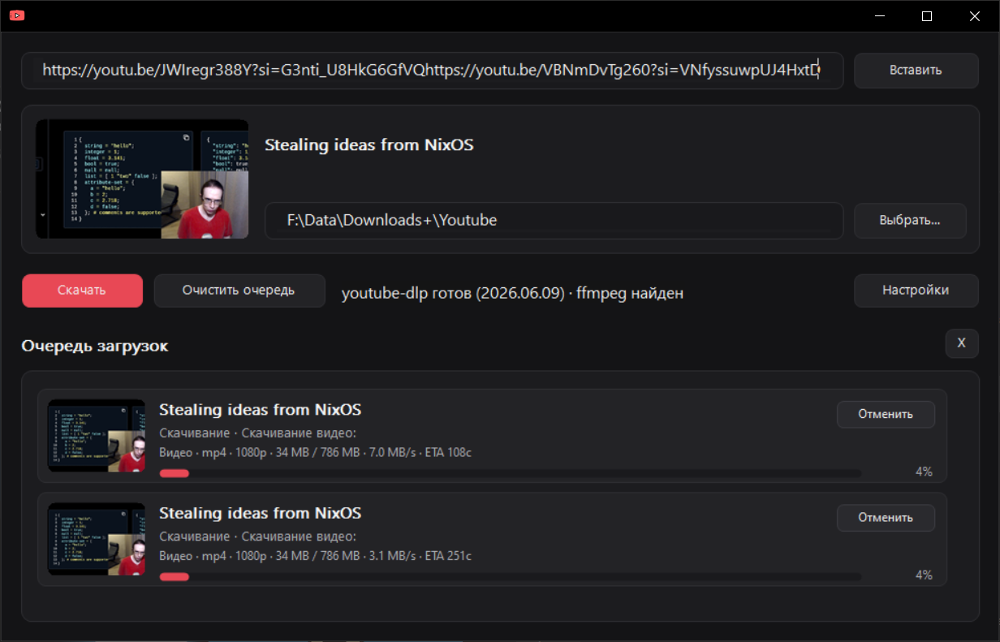
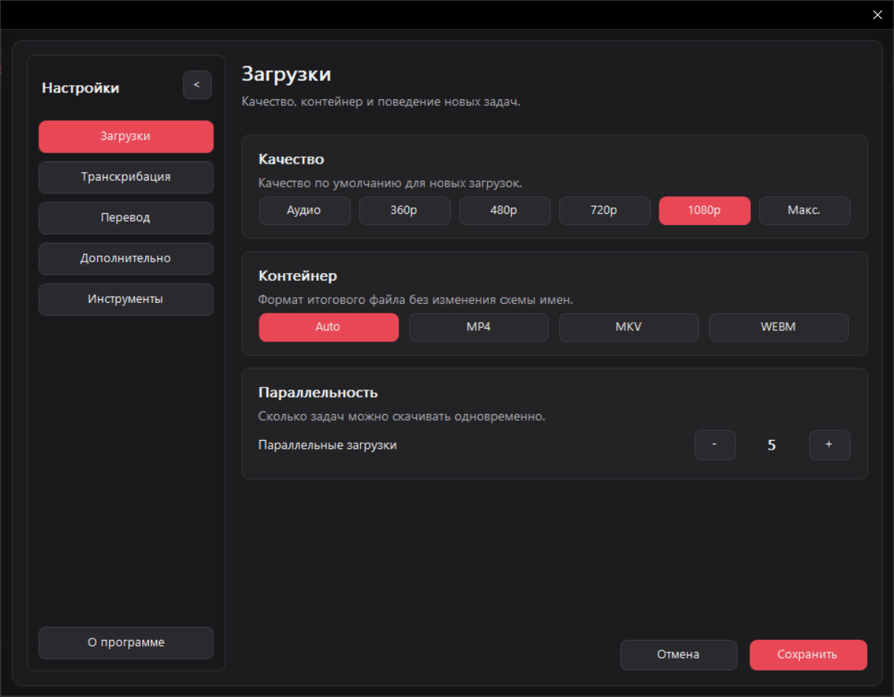
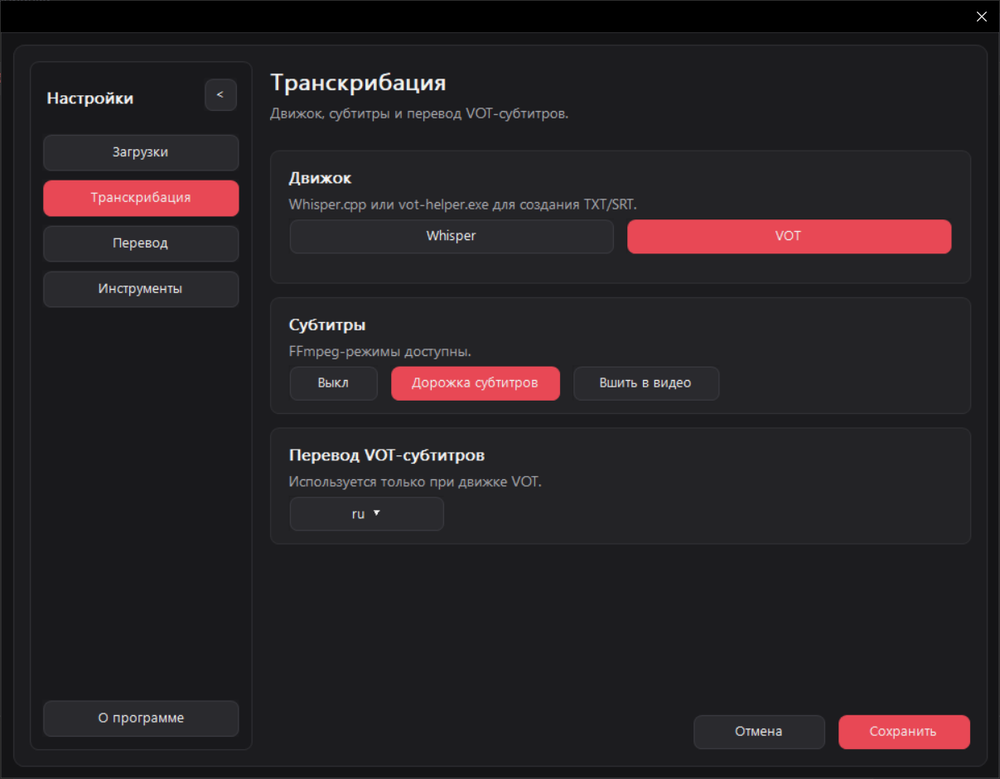
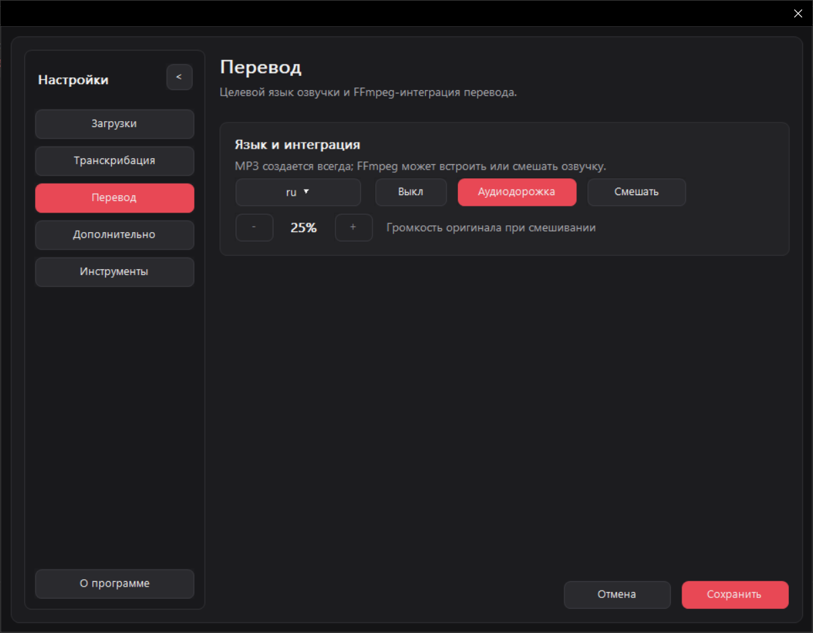
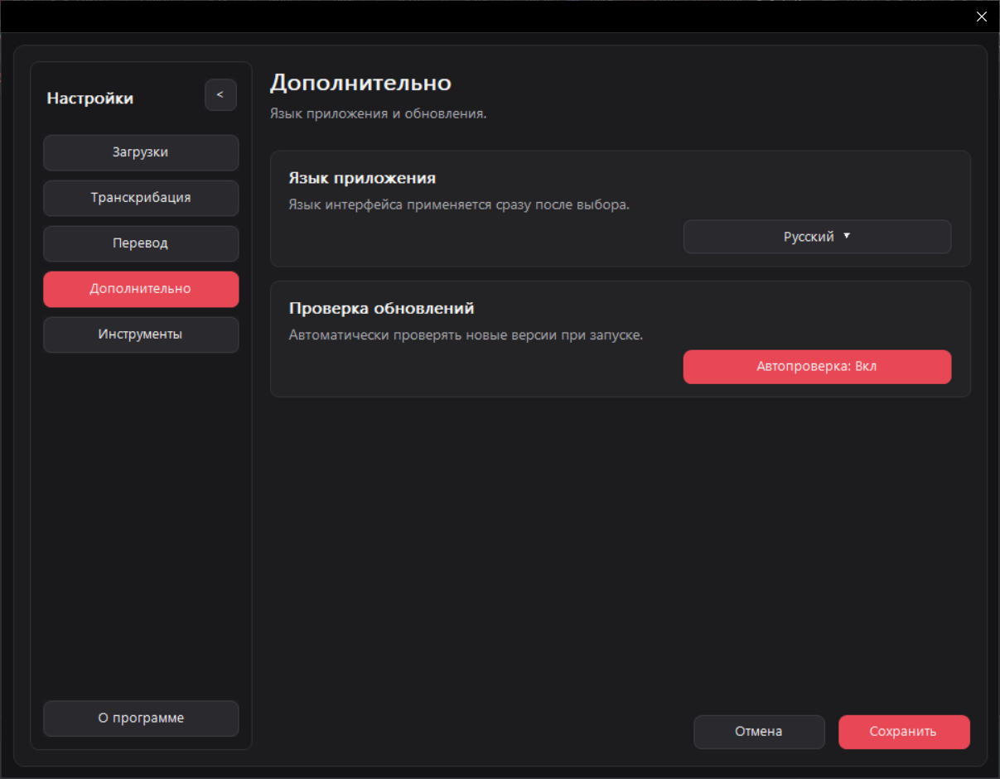
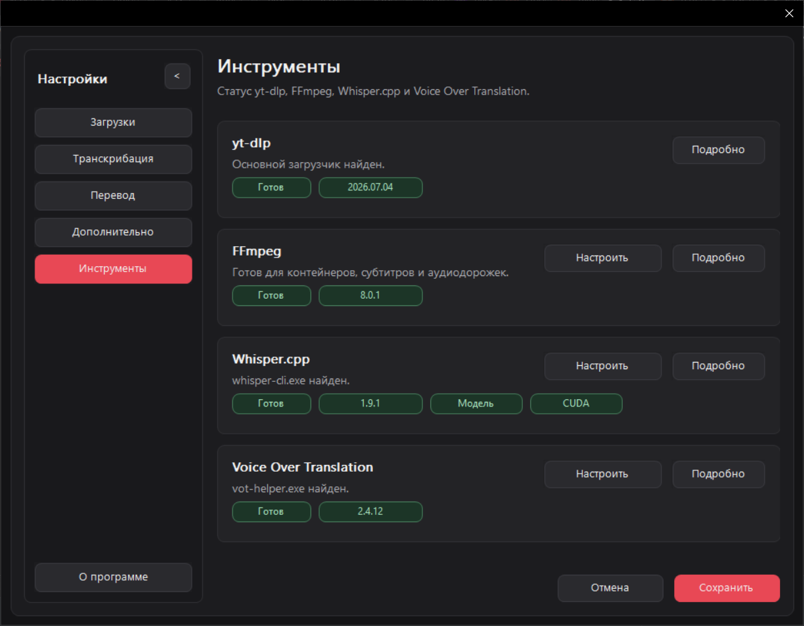

# YoutubeDownloader

[English README](README.en.md)

YoutubeDownloader - портативное Win32-приложение для скачивания видео, плейлистов и аудио с YouTube через `yt-dlp`. В приложении есть нативный Windows-интерфейс, очередь загрузок, предпросмотр названия и обложки, а также поддержка FFmpeg для объединения и обработки медиа.

## Screenshots













## Стек

- C++20
- CMake 4.2+
- Нативный Win32 UI: GDI+, DWM, Common Controls
- WinHTTP для HTTP-запросов и скачивания файлов
- `yt-dlp` для получения метаданных и скачивания медиа
- FFmpeg/FFprobe для объединения и обработки медиа
- `nlohmann/json` single-header library в `third_party/`
- MSVC из Build Tools for Visual Studio 2026 под Windows

## Сборка

Требования:

- Windows
- Build Tools for Visual Studio 2026 с MSVC x64/x86 и Windows SDK; IDE Visual Studio не обязательна
- CMake 4.2 или новее для генератора Visual Studio 2026

Сконфигурировать и собрать release-версию:

```powershell
cmake -S . -B build -G "Visual Studio 18 2026" -A x64 -T v145
cmake --build build --config Release
```

При сборке через Visual Studio generator исполняемый файл будет лежать в `build/bin/Release/`.

Release-сборка x64 проверена с Build Tools 2026, MSVC 19.51 и Windows SDK 10.0.26100.0.

Если папка `build` настроена для другой версии Visual Studio, добавьте `--fresh` к команде конфигурации. Кэш CMake будет пересоздан, а остальные файлы в `build`, включая файлы рядом с EXE, сохранятся.

Запуск тестов:

```powershell
ctest --test-dir build -C Release --output-on-failure
```

## Runtime

Для запуска Release-сборки x64 нужен актуальный пакет [Microsoft Visual C++ Redistributable x64](https://aka.ms/vc14/vc_redist.x64.exe). Если пакет отсутствует или устарел, установите или обновите его перед запуском приложения. Visual Studio для запуска готового EXE не требуется.

При запуске приложение проверяет наличие `yt-dlp` и может установить или обновить его из официальных GitHub Releases. FFmpeg можно указать вручную, найти через `PATH` или установить в локальную папку инструментов приложения.

## Локализация

Русский язык встроен в приложение. Дополнительные языки интерфейса загружаются из `stuff/languages/*.json`.

Формат файлов перевода и правила добавления языков описаны в [`stuff/languages/README.md`](stuff/languages/README.md). Английский перевод лежит в [`stuff/languages/en.json`](stuff/languages/en.json).

## Лицензия

Проект распространяется под лицензией MIT. См. [`LICENSE`](LICENSE).

Сторонние библиотеки и внешние инструменты сохраняют собственные лицензии. См. [`THIRD-PARTY-NOTICES.md`](THIRD-PARTY-NOTICES.md).
